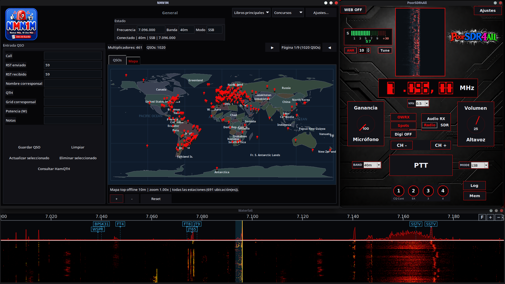

<p align="center">
  
</p>

# PoorSDR4All

Consola de operación de radio: control CAT, proxy rigctld, OpenWebRX+, cascada,
modos digitales, servidor web remoto, macros de llamada y plugins.

📖 **Wiki / documentación de usuario:** https://acuanticopower.com/poorsdr4all/

<p align="center">
  
</p>

Esta es la primera versión pública **Alpha**. Es funcional en el entorno
principal de desarrollo, pero todavía necesita validación comunitaria con más
radios, dispositivos de audio y sistemas operativos.

## Instalación en Linux — instalador gráfico (recomendado)

La forma más sencilla de instalar PoorSDR4All es el instalador gráfico
oficial: un único fichero autoextraíble que instala dependencias, OpenWebRX+,
la fuente LED del frecuencímetro y un acceso directo en el menú de
aplicaciones, sin tocar la terminal.

**[⬇ Descargar el instalador para Linux (Releases)](https://github.com/Acuantico/poorsdr4all/releases/latest)**

Compatible con Arch Linux, Debian, Ubuntu y Raspberry Pi OS (64 bits).
Verifica la integridad del fichero descargado con el `.sha256` que acompaña a
cada versión:

```sh
chmod +x poorsdr4all-installer-*-linux.run
sha256sum -c poorsdr4all-installer-*-linux.run.sha256
./poorsdr4all-installer-*-linux.run
```

Bajo el capó ejecuta literalmente `scripts/install.sh` (ver más abajo) con una
interfaz gráfica encima — no reimplementa nada. Detalles del asistente,
variables de entorno y verificación en
[`installer-build/README.md`](installer-build/README.md) y
[`docs/INSTALL.md`](docs/INSTALL.md).

## Estado por plataforma

| Plataforma | Estado de la Alpha | Alcance |
|---|---|---|
| Arch Linux x86-64 | Validación funcional del mantenedor | Plataforma principal |
| Debian/Ubuntu x86-64 y arm64 | Compilación y pruebas automatizadas previstas | Pendiente de validación con hardware real |
| Windows 10/11 x86-64 | Paquete Python, pruebas y acelerador C previstos en CI | Experimental; OpenWebRX+ debe ser remoto o ejecutarse mediante WSL2 |

Los resultados de CI comprueban que el código se instala, se prueba y se
compila; no equivalen a una prueba física de radio, CAT, SDR o audio. Los fallos
de otras plataformas son bienvenidos en el gestor de incidencias.

## Instalación manual desde el código fuente

Alternativa al instalador gráfico de arriba: para Windows, para quien prefiera
revisar cada paso, o para integrar PoorSDR4All en un entorno propio. Se
requiere Python 3.11 o posterior. El acelerador C es opcional: si no se
compila, la cascada utiliza la implementación Python incluida.

```sh
git clone https://github.com/Acuantico/poorsdr4all.git
cd poorsdr4all
python -m venv .venv
. .venv/bin/activate
python -m pip install --upgrade pip
python -m pip install .
python scripts/build_native.py       # opcional
python -m poorsdr
```

En PowerShell de Windows:

```powershell
git clone https://github.com/Acuantico/poorsdr4all.git
Set-Location poorsdr4all
py -3.11 -m venv .venv
.venv\Scripts\Activate.ps1
python -m pip install --upgrade pip
python -m pip install .
python scripts\build_native.py       # opcional; requiere MSVC, clang o gcc
python -m poorsdr
```

El instalador completo de OpenWebRX+ para Arch y Debian está documentado en
[`docs/INSTALL.md`](docs/INSTALL.md). No se incluyen binarios nativos en el
repositorio: cada equipo los compila para su sistema.

## Plugins incluidos

Los plugins son distribuciones separadas y opcionales:

```sh
python -m pip install ./plugins/filter-relays
```

El botón «Log» lo aporta **[Nunca Más, Ni Una Más (NMN1M)](https://github.com/Acuantico/nmn1m)**,
un cuaderno de estación / contest logger que es su propio proyecto
independiente, con su propia wiki: https://acuanticopower.com/nmn1m/ —
instálalo aparte en el mismo entorno para que la consola lo descubra; sin él,
la consola funciona igual, solo sin ese botón.

La configuración, logs y bases de datos se guardan en los directorios del
usuario, nunca dentro del paquete instalado.

## Arquitectura

```text
poorsdr/
  infra/        rutas de usuario, logging y EventBus
  config/       modelo tipado y migración de configuración
  core/         lógica pura de CAT, bandas, sintonía, cascada y OWRX
  services/     ciclo de vida de radio, audio, rigctld, OWRX y web
  ui/           interfaz Tkinter
  viewers/      cascada y panel digital
  i18n/         traducciones
  _vendor/      adaptadores heredados y componente AGPL identificado
```

La dirección de dependencias es `ui → services → core/config/infra`. Consulta
[`docs/ARCHITECTURE.md`](docs/ARCHITECTURE.md) para el detalle.

## Seguridad

El servidor web está desactivado por defecto y no arranca sin contraseña y
secreto de firma. No publiques directamente en Internet los puertos CAT,
rigctld, OpenWebRX o spiderd. Consulta [`SECURITY.md`](SECURITY.md).

## Licencias

El código original de PoorSDR4All se ofrece bajo la
**[PolyForm Noncommercial License 1.0.0](https://acuanticopower.com/poorsdr4all/license)**.
Para uso comercial se requiere un acuerdo separado con **Acuantico Power**:

https://acuanticopower.com/contacto/

PoorSDR4All es código fuente disponible (*source-available*), no software de
código abierto aprobado por la OSI. Algunos componentes y datos conservan
AGPL, GPL, BSD, MIT, CC-BY o dominio público. Sus revisiones, cambios,
atribuciones y textos se encuentran en
[`THIRD_PARTY_NOTICES.md`](THIRD_PARTY_NOTICES.md) y `LICENSES/`.

Las contribuciones externas requieren aceptar [`CLA.md`](CLA.md). Las normas
están en [`CONTRIBUTING.md`](CONTRIBUTING.md).

## Desarrollo y release

```sh
python -m pip install -e ".[dev,web]"
ruff check src tests
mypy src
pytest -q
python scripts/check_release.py
python -m build
python scripts/write_checksums.py
python scripts/check_artifacts.py
```

El procedimiento completo está en [`docs/RELEASING.md`](docs/RELEASING.md).
